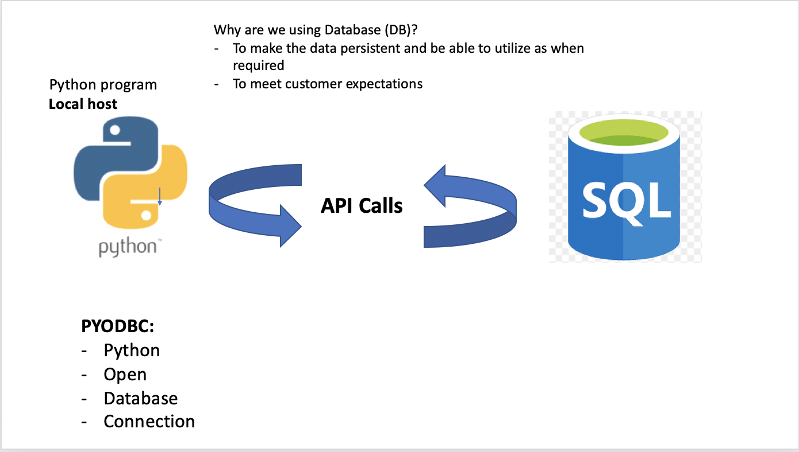

# Python with SQL
## Using PYODBC (open database connectivity) to connect SQL to our Python program
### What is a Cursor and how to use it
**some functions that we can use to interact with SQL data**

- Set up the pyodbc connection
- Command to install pyodbc
```pip install pyodbc```
- once installed create a python_sql.py file
- NOTE!!! Before you do anything, please make sure you have downloaded a pyodbc driver for you specific OS
- For MacOS:
```
/usr/bin/ruby -e "$(curl -fsSL https://raw.githubusercontent.com/Homebrew/install/master/install)"
brew tap microsoft/mssql-release https://github.com/Microsoft/homebrew-mssql-release
brew update
HOMEBREW_NO_ENV_FILTERING=1 ACCEPT_EULA=Y brew install msodbcsql17 mssql-tools
```
```
brew tap microsoft/mssql-release https://github.com/Microsoft/homebrew-mssql-release
```
```
brew install msodbcsql17 mssql-tools
```
* We are now ready to begin! So let's open a .py file

**Establish a Connection**
```
# This lesson will include connection to our SQL DB from Python using PYODBC

import pyodbc

import requests

# pyodbc driver from microsoft helps us to connect to SQL instance
# we will connect our Northwind DB which you have already used in SQL week

server = "databases1.spartaglobal.academy"
database = "Northwind"
username = "**"
password = "************"
northwind_connection = pyodbc.connect('DRIVER={ODBC Driver 17 for SQL Server};SERVER='+server+';DATABASE='+database+';UID='+username+';PWD='+ password)
```
* server name - database name - username and password is required to connect to pyodbc

* Verify Connection
```
cursor = northwind_connection.cursor()
# cursor is location of you mouse/current path

cursor.execute("SELECT @@VERSION")
#select the version of current DB
row = cursor.fetchone()
print(row)
```

* Run a Query to search for the data in our Customers table
```
product_rows = cursor.execute("SELECT * FROM Products").fetchall()
# Running queries in our python program to access database and table inside the DBs

for product_records in product_rows:
# iterate through the table data and find the unit prices

    print(product_records.UnitPrice)
# print(product_rows)
```

* Getting data out of our Products table
```
product_row = cursor.execute("SELECT * FROM Products")
# getting the Product table data

# Iterating through the data until the last line of the data (until condition is False)

# Combination of our loop and control flow to ensure we only iterate through the data as long as the data is available

while True:
    records = product_row.fetchone()
    if records is None:
        # when there are no records left (value is None) stop
        break
    print(records.UnitPrice)
```


**Summary**
- pyodbc installation and connection set up 
- cursor utilisation
- fetchone() (select and record)
- fetchall() (select all records)
